# 学生成绩管理系统

### 一.项目概述

- 项目名称：学生成绩管理系统
- 开发时间：2021
- 开发涉及：Node,MongoDB,Vue,Bootstrap,开发工具(vscode)
- 项目描述：通过 nodejs+mongodb 完成一个学生成绩管理系统：1.登录界面 2.注册界面 3.添加功能 4.修改功能 5.删除功能 6.精确查询功能 7.模糊查询功能 8.数据分页

### 二.开发介绍

Nodejs：简单的说 Node.js 就是运行在服务端的 JavaScript。Node.js 是一个基于Chrome JavaScript 运行时建立的一个平台。

它是一个事件驱动I/O服务端JavaScript环境，基于Google的V8引擎，V8引擎执行Javascript的速度非常快，性能非常好。

MongoDB:MongoDB 是一个基于分布式文件存储的数据库。由 C++ 语言编写。旨在为 WEB 应用提供可扩展的高性能数据存储解决方案。MongoDB 是一个介于关系数据库和非关系数据库之间的产品，是非关系数据库当中功能最丰富，最像关系数据库的。

Vue:Vue.js（类似于 view） 是一套构建用户界面的渐进式框架。Vue 只关注视图层， 采用自底向上增量开发的设计。Vue 的目标是通过尽可能简单的 API 实现响应的数据绑定和组合的视图组件。

Bootstrap:bootstrap是前端开发中比较受欢迎的框架，简单灵活，基于html,css和javascript,是我在前端用的最多的一个框架。

### 三.登录界面

使用了第一次上课自己做的一个小图标favicon.icon

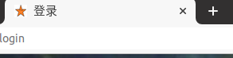

实现把username，password传入数据库中的集合users，在数据库中进行信息的查询，核对，若信息无误就跳转至index，错误的话直接退回login界面。该系统是给管理员使用的，所以只有一个登录口。

在登录的下方有一个“没有账号，立即注册”，其中“立即注册”是有href=‘/regist’可以直接点击进入注册界面。

### 四.注册界面

注册界面有输入用户名，输入密码和确认密码这三项，只有两次密码输入相同时才可以注册成功，注册成功后插入数据库中的users，这样登录的时候在输入用户名和密码就会model.find用户名和密码

### 五.主功能展示

- 导入新数据的功能
  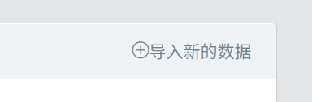

点击加号就可以插入新的学生成绩

- 学生数据的导入

  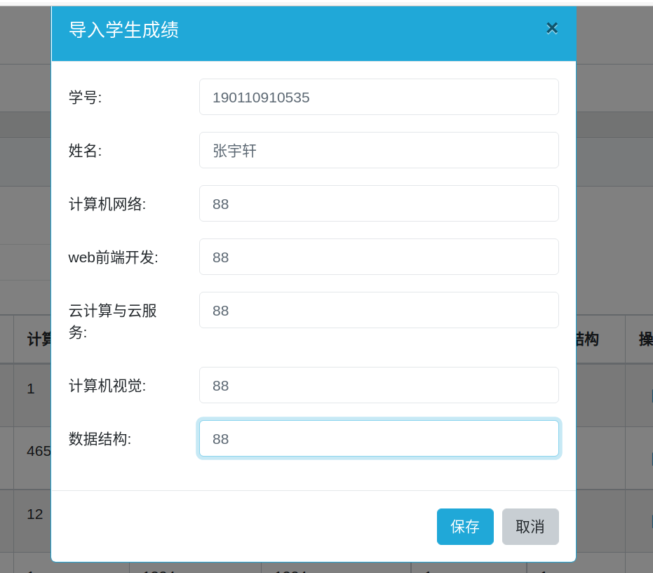

  添加成功后会有操作成功提醒

  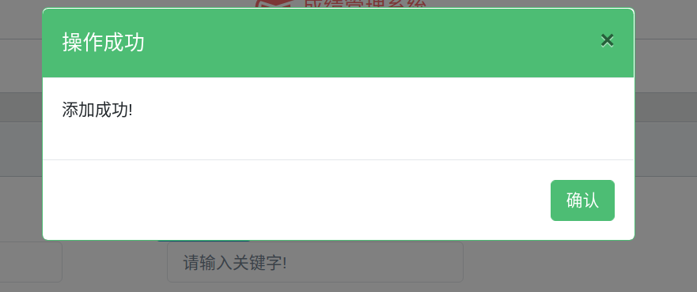

  在填写学生信息时会有数据的格式要求

  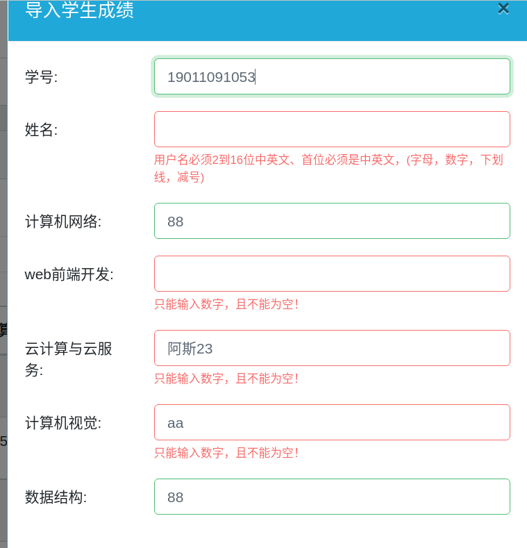

  在没有数据导入时点击导入数据会随机生成7位数字，并姓名为“测试”，这样用于这个学生成绩管理系统的测试用。

- 数据分页功能

  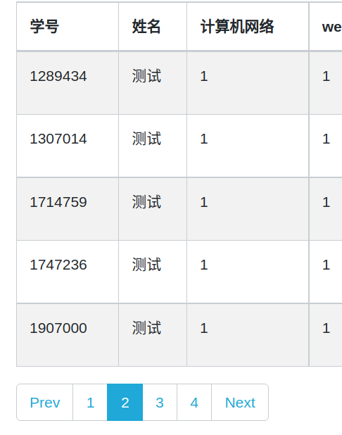

  当每页数据达到最大值5的时候，自动添加到下一页并在下方生成页码，其中添加Prev和Next两个按钮，可以点击前往当前页面的上一页或者下一页。

- 查询功能

  如果想要返回的话点击上方的首页/学生成绩表即可返回首页所有学生成绩表。

  

  模糊查询的功能在于输入姓名关键词之后会找出带有该关键词的所有学生姓名对应的数据。

  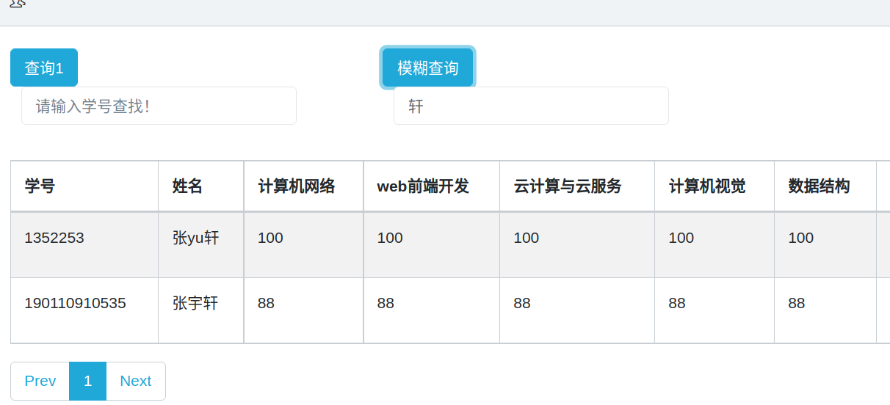

  当然如果输入的用户不存在的话会给出提醒

  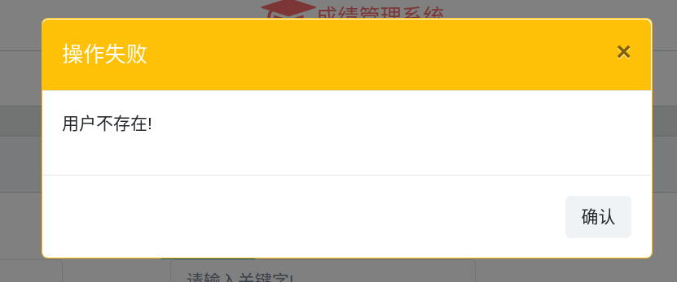

- 编辑或删除已有的学生信息

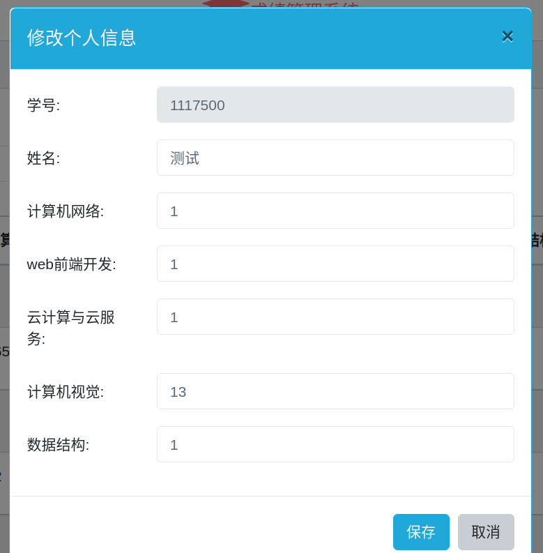

点击编辑就可以修改，但是如果没有修改任何数据的话就会给出报错提醒。

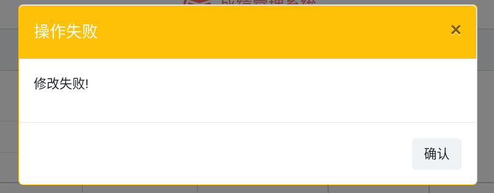

点击删除即可删除数据并从数据库中移除该条数据。

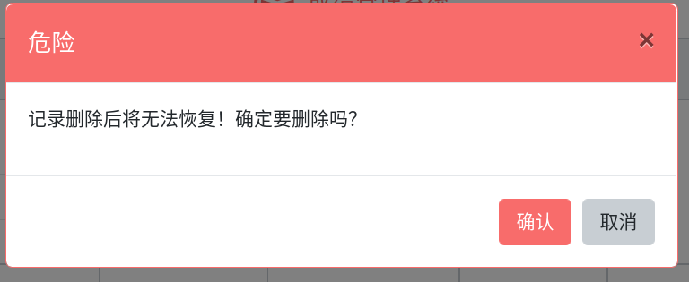

- footer

  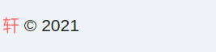

  点击会跳到Github.com
  
  ### 六.开发日记
  
  2021.12.28 ： Set up a project,build login.htmlregist.html
  
  ​						fix router and mongodb bug long long time
  
  ​						 Add a file:index.html
  
  ​						Install express successfully
  
  ​						install mongoose successfully
  
   						write readme.md
  
  2021.12.29 ： mongodb success form web.
  
  ​				     	bootstrap optimize interface
  
  2021.12.30 ： install  jquery successfully
  
  ​						 improve the function of index
  
  2021.12.31 ： add some home pages and functions
  
  ​						 complete some functions.
  ​						 Improve the database of login and registration
  
  ​						optimize interface
  
  ​						 write readme.md
  ​						 update readme.md

### 七.总结

  在经过本学期的开源软件开发学习后，又通过大作业的方式再次学习巩固这门科目，学会使用了nodejs，以及使用mongoose这种数据库语言，并在虚拟机上完成一系列操作，受益匪浅，当然在有些地方自己的学习以及开发能力有待加强，还要继续学习提高。
